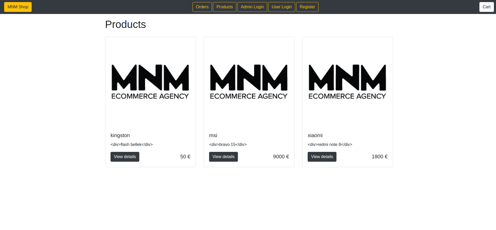

MNM Shop
==========

This repository contains all the code about the tutorial: Building a E-commerce Site with "Symfony 4.4". 




Requirements
------------

- PHP 7.4.3
- [Composer](https://getcomposer.org/download)
- [Symfony CLI](https://symfony.com/download)

Getting started
---------------

**Cloning the repository**

```
https://github.com/furkangildir/symfonyEcommerceSite.git
$ cd symfonyEcommerceSite/
```

**Installing dependencies**

```
$ composer install
```

**Launching the Local Web Server**

```
$ symfony server:start -d
```

The server started on the port 8000. Open the website http://localhost:8000 in a browser.

Usage
-----

**Adding products and categories to the database**

We add the admin with the role ["ROLE_ADMIN"] to the database. After going to the [admin login](http://localhost:8000/admin) page and logging in with your email and password, we can add your products and categories.

**Viewing orders in the admin panel**

After logging in with your admin user name and password, you can view the products ordered from the order sections.

**Creating a new user**

You can log in from the [user login](http://localhost:8000/login) panel by creating a member registration from the [register panel](http://localhost:8000/register).

**Viewing orders from the user panel**

You can view orders from [orders page](http://localhost:8000/order) by logging in from the [user panel](http://localhost:8000/login).

**Adding Products to the Cart**

From the [homepage](http://localhost:8000/), go to a product page by clicking on the *View details* button. Then set a quantity and click on the *Add to Cart* button.

**Removing Products from the Cart**

From the [cart page](http://localhost:8000/cart), click on the *Remove* button for the product you want to remove.

**Updating the quantity of products in the Cart**

From the [cart page](http://localhost:8000/cart), enter the desired quantity for the products and click on the *Save* button.

**Clearing the Cart**

From the [cart page](http://localhost:8000/cart), click on the *Clear* button.

Testing
-------

**Configuring a Database for Tests**

Create the database and update the database schema by executing the following command:
```
$ bin/console doctrine:database:create
$ bin/console doctrine:migrations:migrate
```
